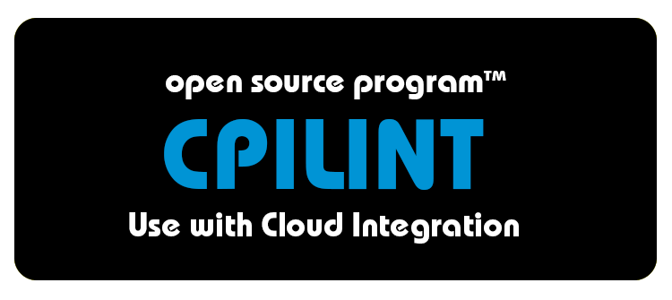

Welcome to the CPILint GitHub repository!

## What is CPILint?

CPILint is a command-line tool that automates your SAP Cloud Integration governance. It ships with a range of built-in rules covering topics like developer guidelines, naming conventions and security. You choose the rules you want to put in place, and CPILint does the heavy lifting of checking your integration flows for compliance.

## Documentation

Instructions on installing and using CPILint are available in the [wiki](https://github.com/mwittrock/cpilint/wiki).

## License

CPILint is licensed under the MIT open-source license. For the full license text, please see the LICENSE.txt file in the root of the repository.

## Contributing

The CPILint project is not currently looking for code contributions. This may change in the future.
